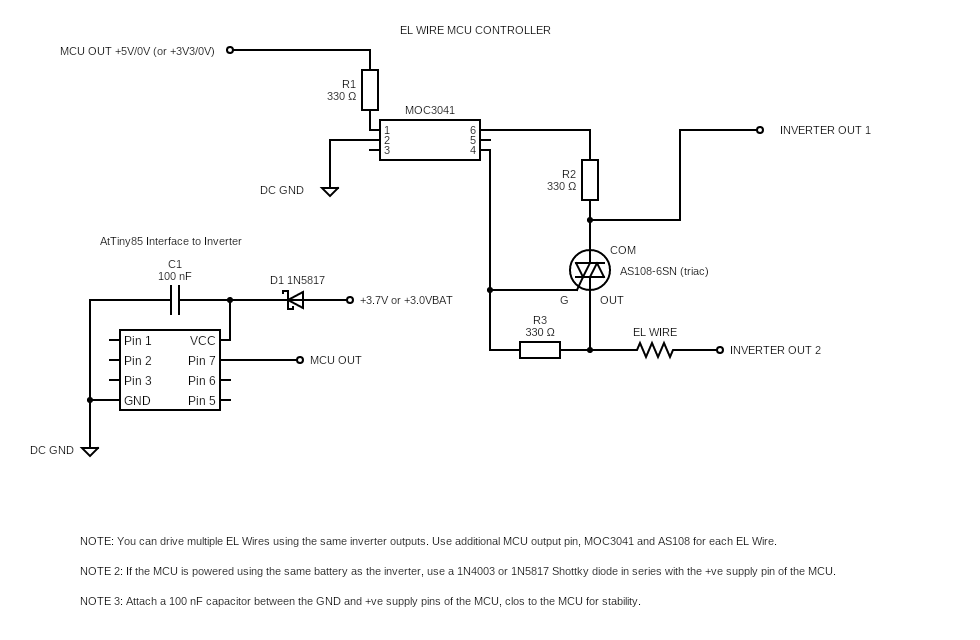

# 24014 - CONTROLLING EL WIRES USING A MICROCONTROLLER
---

In this video we are introducing a fundamental and simple method that will allow you to switch your EL wires using the mighty ATtiny85 microcontroller.

Following is the circuit diagram of the fading controller. IT is a simple circuit that uses an opto coupler and an AC switch.

You can access the AtTiny85 software code using the following link.

Though the above code showcases one light pattern shown in our **<u>[project video][1]</u>**, there are many more fading patterns you can create simply by modifying the source code. The function we demonstrate int eh video is called count_to_three() but we included a few other cool ones for you to play with :) Feel free to add your own!

If you build this project, please share your thoughts and suggestions with the rest of circuitapps community in the comments section of **<u>[our YouTube video][1]</u>**. Also, please feel free to talk about any interesting modifications you make and your experimentations, if any !

## Project Challenges
There are a few things to be careful with while building this project to make sure you get it working after the first attempt

### **Caution 1 - Power supply voltage**

Though we are using a modified inverter we built in **<u>[this guide video][2]</u>**, you can power the AtTiny85 using alternative DC power sources. Just make sure the ground of the EL wire inverter and the power supply are connected it that's what you are planning to do.

## Useful tips

### **Tip 1:**
If you have not worked with ATtiny85 before and need support with the basic operation and programming of this device, have a look at this **<u>[excellent reference][3]</u>** that walks you through the entire process step by step. If you get stuck, drop us a message in the comments section of **<u>[our YouTube video][1]</u>**

GOOD LUCK & ENJOY EXPERIMENTING WITH HOW MICROCONTROLLERS CAN TRANSFORM EL WIRE LIGHT PATTERNS !

[1]: https://youtube.com/shorts/Xhm6lb3zpco

[2]: https://youtu.be/yBwCZ95K7WI

[3]: https://circuitdigest.com/microcontroller-projects/programming-attiny85-microcontroller-ic-using-arduin